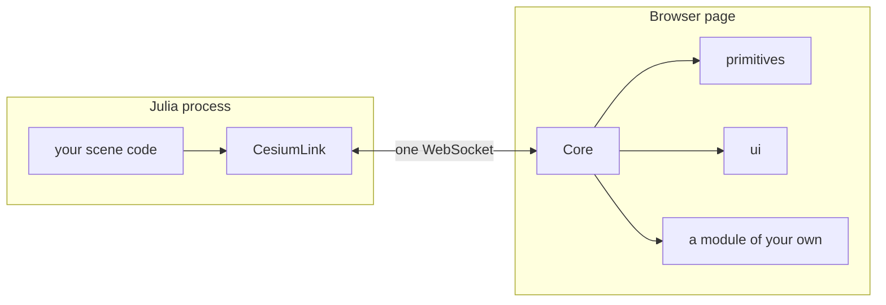

# The shape of the system

The browser holds a small runtime called the **Core**. Every decision about what the scene contains
lives in the Julia process, and reaches the Core as a **module**'s payload. The Core carries that
payload to the module that owns it and never looks inside.

## What the Core owns

The Core is the part of the browser side that no scene author writes and no module replaces. It
owns eleven things.

- **The transport.** One binary WebSocket at `/ws`, same-origin with the page. Either side may send.
- **The envelope.** `{module, topic, payload}`. The Core routes on the first two fields alone.
- **The clock.** One clock for the whole page, set from the declared range a window states. A module
  reads it and never drives it.
- **The window buffer.** The delivered keyframes, their coverage, the eviction that bounds them, and
  the request that tops them up. See [Windows, keyframes and identity](windows.md).
- **Module loading.** The version gate, the three-pass loader, and the teardown that drains what a
  module registered.
- **Entity-ID namespacing.** `ctx.pickId(kind, idx)` stamps a primitive with the module's own id.
  The Core drills past an unstamped primitive, so a decoration never masks what it covers.
- **Pick dispatch.** One `ScreenSpaceEventHandler`, one pixel read per pointer move, and a stack of
  owned hits offered to every local handler in turn (ADR-0003).
- **Overlay regions.** Four named positions on screen. A module contributes DOM and never positions
  it; the Core refuses the eight CSS properties that would move a region (ADR-0004).
- **The array codec.** The one thing the Core understands inside a payload. See
  [Arrays on the wire](arrays.md).
- **Same-origin assets.** The page, the Cesium runtime and each declared module's directory come
  from the one process that holds the socket. So `import()` raises no CORS question, and the design
  works inside a webview under a strict `script-src`.
- **Furniture.** The nine items the Core puts on screen: the clock face, the timeline ruler, the
  keyframe readout, and the six corner buttons. The server declares which pieces are on screen as
  one set (ADR-0015).

## What the Core deliberately does not do

Three absences are load-bearing.

**It models no entities.** A satellite is a row of an array in a payload that `primitives` reads.
The Core knows only that the payload holds an array and that a keyframe addresses a block of it. If
the Core learns what a family is, payload opacity ends, and every scene shape must be expressed in a
vocabulary the browser already knows.

**It interpolates nothing.** The module blends between two keyframes on every render tick. The Core
states which keyframe brackets the current instant and how far the blend has gone, and never
throttles it, because smooth motion is the reason the buffer exists.

**It never reads inside a payload.** The one exception is the encoded array: the codec finds a
three-field object at any nesting depth and replaces it with a typed array. So a decoder needs no
schema, and a new payload shape needs no Core change.

Two smaller absences follow. The Core keeps no visibility state, because filtering is the server's
answer (ADR-0007). And it never drops a stale command batch, because only the receiving module knows
whether a late answer is still worth having.

## Why the line falls there

The alternative was a viewer that knows the domain: a satellite type, a filter language, and a new
wire field for every new question anyone asks of the data.

It lost on one case. A mask cannot express a filter that changes *derived* values: restricting a
constellation to one shell makes cells genuinely unserved, and no per-entity visibility flag says
that. The server recomputes the answer anyway, so the viewer's filter machinery is a second copy of
a decision it cannot make correctly.

The line costs a round trip. The server answers a tooltip, a toggle and a click, so each costs a
message up and a message down: a few milliseconds on the same host, visible over a wide-area link.
The fix, if it ever bites, is a module-local immediate tier that reintroduces the duplication this
design removed (ADR-0010).

## Modules, and the vendored ones

A module is one ES module whose default export has a `setup(ctx)`. The Core hands it a context
object carrying every capability it may use: the shared Cesium namespace, the scene, the clock, the
window and frame callbacks, pick stamps, overlay access, and the two functions that address a
keyframe inside an array. A module imports Cesium for types only, because two live copies of Cesium
in one page cannot share a scene and the failure shows up as blank geometry.

Four modules ship inside the viewer bundle: `primitives`, `ui`, `heatmap` and `models`. They are
**vendored**: each is told only a shape, a value or a colour, and never a domain concept. `heatmap`
is told a grid of colour over a box of degrees, and never whether the field is a rain fade. A module
that must be told about rain fade ships from the package that owns that word.

A vendored module has **no privileged loading path**. The same call declares it, the same
`apiVersion` gates it, and the same `import()` imports it, so the shipped modules exercise on every
run the route a third-party module takes. A vendored module that nobody declares does not load.

[Modules, vocabularies and glue](modules.md) covers the payload vocabularies, the loading order, and
what may cross between two modules.

## How a session starts

The order is fixed. Each step depends on the one before it.

1. The browser opens the socket and announces the protocol version it speaks. A server on another
   version closes the socket with a reason: every frame is binary, so a viewer built against another
   framing parses none of them and reports nothing.
2. The server sends the session declaration: which modules to load, and the shape of the globe. A
   browser host waits for it before building its widget, so the globe is never built on an ellipsoid
   the server did not name.
3. The server replays its retained state: the latest command per `(module, topic)`, then the current
   window.
4. The Core imports every declared module concurrently, runs each `setup` in declaration order, then
   replays the retained commands.

After that the session is two streams of notifications: windows and command batches travel down,
events travel up, and nothing waits for a reply. The [wire protocol](../reference/wire/protocol.md)
is the normative statement; the [module API](../reference/wire/module-api.md) states what a module
is handed.

## What this shape rules out

Three things are impossible by construction.

- **A module cannot change what another module drew.** It may read a position through an accessor
  the owner exports, and draw its own primitives coincident with those. A viewer-side mutation has
  no author on the server, so the next window silently overwrites it (ADR-0006).
- **The module set cannot change during a session.** It is established per connection, and changing
  it means the client reconnects. A session whose module set changes underneath it has no coherent
  story for the state the departing module owned.
- **Nothing travels upward as bytes.** No arrays go up today. The server is authoritative, so bulk
  data flowing upward inverts the model. The framing is symmetric and the upward encoder is not
  built, so adding it later writes code and does not amend the contract.
