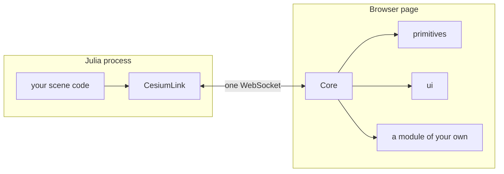

# The shape of the system

CesiumLink puts one decision in one place. The browser holds a small runtime called the **Core**.
Every decision about what the scene contains lives in the Julia process, and reaches the Core as a
**module**'s payload. The Core carries that payload to the module that owns it and never looks
inside.

That sentence is the whole architecture. The rest of this page states what it costs, what it buys,
and where the line falls in practice.

## What the Core owns

The Core is the part of the browser side that no scene author writes and no module replaces. It
owns eleven things.

- **The transport.** One WebSocket at `/ws`, same-origin with the page. Either side may send, and
  every frame is binary.
- **The envelope.** A message addressed at a module carries `{module, topic, payload}`. The Core
  routes on the first two fields alone.
- **The clock.** One clock for the whole page, configured from the declared range a window states.
  A module reads it and never drives it.
- **The window buffer.** The delivered keyframes, the coverage they claim, the eviction that bounds
  them, and the request that tops them up. [Windows, keyframes and identity](windows.md) covers this
  in full.
- **Module loading.** The version gate, the three-pass loader, and the teardown that drains what a
  module registered.
- **Entity-ID namespacing.** `ctx.pickId(kind, idx)` returns a stamp carrying the module's own id.
  A primitive that carries no such stamp is drilled past rather than picked, so a decoration drawn
  over something pickable never masks it.
- **Pick dispatch.** One `ScreenSpaceEventHandler` for the whole page, one read of one pixel per
  pointer move, and a stack of owned hits offered to every local handler in turn
  (ADR-0003).
- **Overlay regions.** Four named positions on screen. A module contributes DOM into one and never
  positions it, and the Core refuses the eight CSS properties that would move a region
  (ADR-0004).
- **The array codec.** The one thing the Core understands inside a payload. See
  [Arrays on the wire](arrays.md).
- **Same-origin assets.** Everything the page loads comes from one origin: the page itself, the
  Cesium runtime, and each declared module's directory. One process serves all of it and holds the
  socket. A module therefore imports over `import()` with no second origin and no CORS question,
  which is also what makes the design work inside a webview under a strict `script-src`.
- **Furniture.** The nine items the Core puts on screen itself: the clock face, the timeline ruler,
  the keyframe readout, and the six corner buttons. The server states which pieces are on screen as
  one declared set (ADR-0015).

## What the Core deliberately does not do

Three absences are load-bearing.

**It models no entities.** There is no node, no link and no satellite anywhere in the Core. A
satellite is a row of an array in a payload that `primitives` reads. The Core knows that the payload
holds an array and that a keyframe addresses a block of it, and nothing more. The moment the Core
learns what a family is, payload opacity is gone and every scene shape has to be expressed in a
vocabulary the browser already knows.

**It interpolates nothing.** Blending between two keyframes happens in the module, next to the
module's own arrays, on every render tick. The Core states which keyframe brackets the current
instant and how far the blend has gone. It never throttles that, because smooth motion is the
reason the buffer exists.

**It never reads inside a payload.** The one exception is the encoded array, and it is narrow on
purpose. The codec recognises a three-field object wherever it appears, at any nesting depth, and
replaces it with a typed array. Nothing else about a payload's structure is interpreted anywhere in
the browser. So a decoder needs no schema, and a new payload shape needs no Core change.

Two smaller absences follow from the same rule. The Core keeps no visibility state, because
filtering is the server's answer rather than a mask the viewer applies
(ADR-0007). And the Core never drops a stale
command batch, because whether a late answer is still worth having depends on what it says, which
only the receiving module knows.

## Why the line falls there

The alternative was a viewer that knows the domain. It draws satellites because it has a satellite
type, and filters them because it has a filter language. It also grows a wire field for every new
question anyone asks of the data.

That design was rejected for a specific reason rather than a stylistic one. A mask cannot express a
filter that changes *derived* values. Restricting a constellation to one shell does not merely hide
satellites: it makes cells genuinely unserved, and no per-entity visibility flag says that. Once the
server has to recompute the answer anyway, the viewer's filter machinery is a second copy of a
decision it cannot make correctly.

The cost of the line is a round trip. A tooltip, a toggle and a click are all answered by the
server, so each of them costs a message up and a message down. On the same host that is a few
milliseconds. Over a wide-area link it is visible, and the fix, if it ever bites, is a module-local
immediate tier that reintroduces exactly the duplication this design removed. That trade is stated
where it was made (ADR-0010) rather than
hidden.

## Modules, and the vendored ones

A module is one ES module whose default export has a `setup(ctx)`. The Core hands it a context
object. Every capability it may use arrives there: the shared Cesium namespace, the scene, the
clock, the window and frame callbacks, pick stamps, overlay access, and the two functions that
address a keyframe inside an array. A module imports Cesium for types only. Two live copies of
Cesium in one page cannot share a scene, and the failure shows up as blank geometry.

Four modules ship inside the viewer bundle: `primitives`, `ui`, `heatmap` and `models`. They are **vendored**
modules, and vendoring is a statement about vocabulary rather than about privilege. A module is
vendored when it is told only a shape, a value or a colour, and never a domain concept. `heatmap`
drapes a grid of finished colour over a box of degrees. It does not know whether the field is an
elevation angle or a rain fade, exactly as `primitives` draws geometry without a notion of a
satellite. A module that must be told about rain fade ships from the package that owns that word.

A vendored module has **no privileged loading path**. It is declared by the same call as anyone
else's, gated by the same `apiVersion`, and imported by the same `import()`. A vendored module that
nobody declares does not load. That is the property worth protecting: one code path means the route
a third-party module takes is the route the shipped modules exercise on every run.

The rest of that story — what a payload vocabulary is, why declaration order stopped deciding
reachability, and what may cross between two modules — is in
[Modules, vocabularies and glue](modules.md).

## How a session starts

The order is fixed, and each step exists because the one after it depends on it.

1. The browser opens the socket and announces the protocol version it speaks. A server that speaks
   another version closes the socket with a reason. Proceeding is worse than refusing: every frame
   is binary, so a viewer built against another framing parses none of them and reports nothing.
2. The server sends the session declaration: which modules to load, and the shape of the globe. A
   browser host does not build its widget until this arrives, so the globe is never constructed on
   an ellipsoid the server did not name.
3. The server replays its retained state — the latest command per `(module, topic)`, then the
   current window.
4. The Core imports every declared module concurrently, runs each `setup` in declaration order, then
   replays the retained commands once every `setup` has returned.

After that the session is two streams of notifications. Windows and command batches travel down,
events travel up, and nothing waits for a reply. The normative statement of all of it is the
[wire protocol](../reference/wire/protocol.md); what a module is handed is the
[module API](../reference/wire/module-api.md).

## What this shape rules out

Three things are impossible by construction, and each was a deliberate choice.

- **A module cannot change what another module drew.** It may read a position through an accessor
  the owner exports, and it may draw its own primitives coincident with those. It may never restyle
  or mutate them. A viewer-side mutation has no author on the server, so the next window silently
  overwrites it (ADR-0006).
- **The module set cannot change during a session.** It is established per connection, and changing
  it means the client reconnects. A session whose module set changes underneath it has no coherent
  story for the state the departing module owned.
- **Nothing travels upward as bytes.** Zero arrays go up today, and the server is authoritative, so
  bulk data flowing upward inverts the model rather than using it. The framing is symmetric and the
  upward encoder is not built, so adding it later writes code rather than amending the contract.
