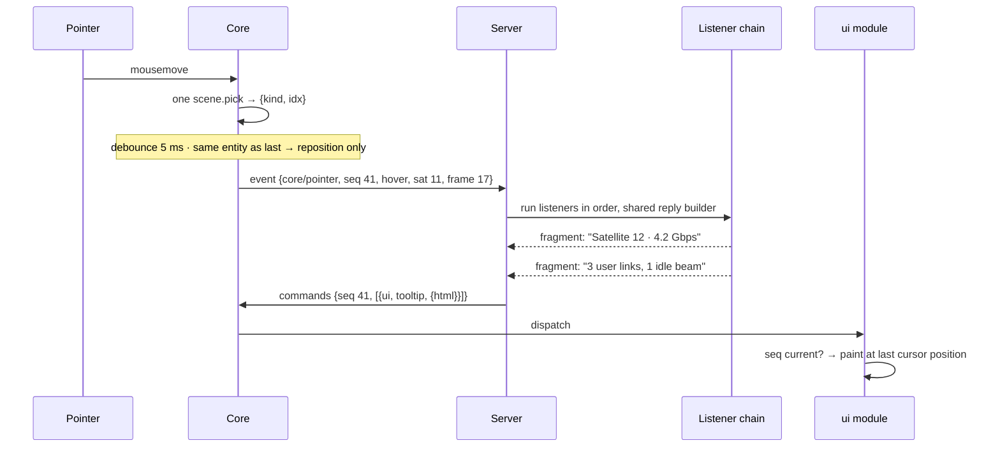
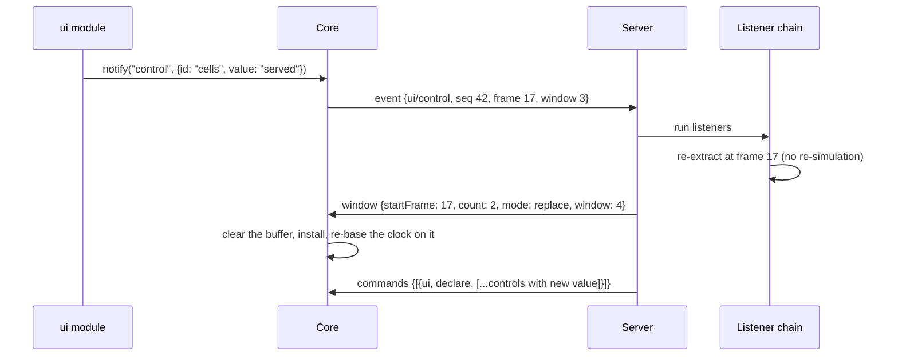
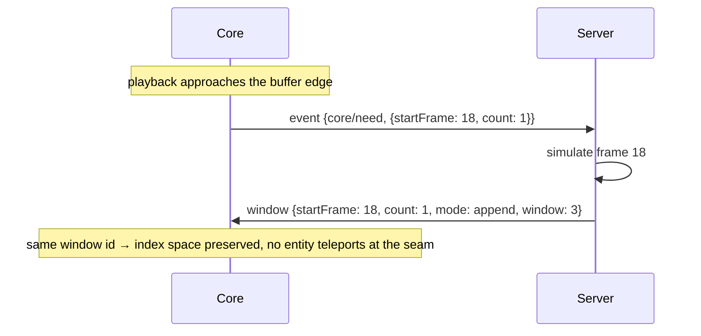

# CesiumLink wire protocol — version 1

Normative contract between the viewer (`lib/`) and a driving server (the Julia package here, or an
implementation of your own). A server implementation must follow this document byte-for-byte.

The other half of the picture is [`module-api.md`](module-api.md): what the ES modules this
protocol declares must implement, and what the Core hands them.

## Framing

One WebSocket at `/ws`, same-origin with the page (browser host: `?ws=<url>`, or `?ws` / `?ws=auto`
for same-origin `/ws`). Either side may send. Every frame is **binary**, and carries one message:

```
[u32 headerLen]   little-endian, at byte 0
[header]          headerLen bytes of UTF-8 JSON: the whole message
[pad]             zero bytes, up to the next multiple of 8
[region]          the array bytes the header points into
```

The region starts at `(4 + headerLen + 7) & ~7`. All integers are little-endian, which every target
platform is. A message carrying no arrays has an empty region.

The header is JSON-RPC-2.0-shaped, without the `jsonrpc` field. A message with an `id` is a request
expecting `{id, result}`; without one it is a notification.

**The protocol uses no requests.** Everything is a notification in one direction or the other,
because every answer is either a command batch or a window — both of which may arrive later, more
than once, or not at all.

The framing is symmetric, and **only the upward half of the array _encoder_ is missing**. Nothing
puts an array in an upward payload today, so a viewer sends an empty region and refuses a typed
array in an event payload, naming `Array.from()`. The receiving half is built: the server splits an
inbound frame into header and region exactly as it splits an outbound one, and decodes an event's
payload against the region it arrived with. So a host that encodes an array upward is read, and
building that encoder writes code rather than amending this contract.

Three methods travel down (server → viewer), two travel up.

| Direction | Method | Purpose |
|---|---|---|
| ↓ | `modules` | The session: which ES modules to load, the shape of the globe, and the furniture |
| ↓ | `window` | A run of keyframes, with every module's payload |
| ↓ | `commands` | A batch of module-addressed commands |
| ↑ | `ready` | Handshake; triggers retained-state replay |
| ↑ | `event` | Anything the viewer reports: pointer, buffer need, control input |

Unknown methods are ignored.

### Version policy

The viewer *announces* on `ready`; the server *decides*. **On a version it does not support the
server closes the socket with a reason.** The number bumps only on breaking changes.

Refusing is the point. A viewer built against a different framing receives a frame it cannot read,
hands it to `JSON.parse` inside a `catch { return; }`, and says nothing — no error, no console
line, no closed socket. The session reads to a user as a server that never sent anything. A magic
number inside the frame cannot catch that, because a viewer that does not know the format will
never look for one. The handshake is the only place the disagreement can be named.

## Encoded arrays

Any numeric array, anywhere in any payload, is encoded as a self-describing object, and its bytes
sit in the frame's region:

```json
{ "$wire": "f32", "shape": [3, 264], "off": 4096 }
```

- `$wire` ∈ `f32 | f64 | u8 | u32 | i32`.
- `shape` is row-major, the last dimension varying fastest, and is **mandatory**. A flat array
  states `shape: [N]`. The two sides enforce it differently: the server rejects a `$wire` object
  without it, while the viewer does not recognise one as an encoded array at all and leaves it in
  the payload as an ordinary value. Emit it always; do not rely on either failure. Row-major is the reverse of Julia's column-major, so a Julia `3 × 264`
  position array states `shape: [264, 3]`. The bytes are untouched: only the labels turn around,
  which is what lets each side read the array in its own idiom. The example above is therefore a
  `264 × 3` array on the Julia side.
- **`off` counts bytes from the start of the region**, never from the start of the frame. A host
  that hands the region over on its own would otherwise need a fixup on one transport and not the
  other.
- **`off` is always a multiple of 8**, whatever the dtype. One rule instead of a table per dtype,
  the waste is at most 7 bytes per array, and 8 is what a `Float64Array` view needs — so every
  array can be a view.
- **The length is not carried.** It is `prod(shape) × bytesPerElement($wire)`. A reader must check
  `off + length ≤ region.byteLength` and refuse the frame when it does not hold. That bound is what
  stands between a malformed frame and a read past the bytes that arrived.

The Core walks every inbound payload and replaces each such object with

```js
{ data: Float32Array, shape: [3, 264] }
```

before handing the payload to its module. **This is the whole of the Core's payload knowledge.**
Nothing else about a payload's structure is interpreted anywhere in the browser, so a decoder never
needs to know the schema to decode.

Each array is a **view into the region**, not a copy of it — `data.buffer` is the whole received
frame. See [`module-api.md`](module-api.md) for what a module keeping one past its window
keeps alive with it.

### What a Julia server converts before sending

Five dtypes travel, so a server holding an array of some other numeric type converts it to the one
that carries it without loss. CesiumLink does this on the way out:

| Julia eltype | travels as | |
|---|---|---|
| `Float32`, `Float64` | `f32`, `f64` | |
| `UInt8`, `UInt32`, `Int32` | `u8`, `u32`, `i32` | |
| `Bool` | `u8` | JS has no boolean typed array; a module reads a flag as `data[i] !== 0` |
| `Int8`, `Int16`, `Int64` | `i32` | error unless every value fits `Int32` |
| `UInt16`, `UInt64` | `u32` | error unless every value fits `UInt32` |
| `Float16` | `f32` | always exact |
| any other `<: Number` | error | `Complex`, `Rational`, `Int128` and the like |
| anything not `<: Number` | JSON list | strings, nested payload objects, `Array{Any}` |

A value the target dtype cannot hold is an error rather than a wrap-around, so the bytes on the wire
always mean what the sender held. An `Int64` past `Int32` is carried by converting it to `Float64`,
exact for `|v| ≤ 2^53`; there is no 64-bit integer dtype.

## ↓ `modules`

The session declaration. Sent once per connection, before anything else, and retained for replay
(ADR-0009).

```json
{ "method": "modules",
  "params": {
    "modules": [
      { "id": "ui",      "url": "/modules/ui/ui.js",           "apiVersion": 1 },
      { "id": "heatmap", "url": "/modules/heatmap/heatmap.js", "apiVersion": 1 }
    ],
    "ellipsoid": { "a": 6378137.0, "b": 6356752.3142451793 },
    "furniture": {
      "items": { "timeline": false, "animation": false, "keyframe": false },
      "region": "top-right"
    },
    "assets": { "models": "assets/models/", "imagery": "assets/imagery/" },
    "imagery": { "url": "assets/imagery/{z}/{x}/{y}.png", "layout": "xyz",
                 "tiling": "mercator", "maxLevel": 5 },
    "lighting": true,
    "stars": true
  }}
```

- **`modules` order is draw order.** The viewer builds the modules in the order sent, which is what
  decides what is drawn over what and how overlay contributions stack. It is not a dependency
  ordering: `ctx.modules.get` reaches every module of the same declaration whatever the order.
- `ellipsoid` is the shape the scene's coordinates are on: the semi-major axis `a` and the
  semi-minor axis `b`, in metres. The viewer builds its globe on it and every conversion it does
  runs against it. **Optional; absent means WGS84**, which is what the viewer uses on its own.
- `furniture` is the set of the Core's own on-screen items, in the shape the `core/furniture`
  command carries. The viewer builds that set before it paints, so a session that hides the ruler
  never shows one. **Optional; absent means the viewer builds its default set**, which is what a
  session that declares no furniture shows, and what a recording made before this field carries.
  The server states the same set again as a retained command on `ready`; the viewer applies that
  restatement as a no-op, building and destroying nothing.
- `assets` names each directory the server serves, mapping the mount name to the same-origin base it
  answers. A payload points at a file by that path — `assets/models/sat.glb` — and a module resolves
  it through `ctx.assetUrl`. **Optional; absent means the server serves no directory of its own.** A
  browser host needs the map for nothing, because a same-origin path already resolves against the
  page; a host whose page sits on another origin builds its own URL per mount out of it. A directory
  of basemap tiles is the reserved mount `imagery`, so the `imagery` declaration's own `url` is a
  path into this same map and not a second idiom (ADR-0021).
- `imagery` is what the globe is textured with: one source as `url`, `layout` (`"xyz"` or `"tms"`),
  `tiling`, and optionally `maxLevel` and `credit`. It has **three** states, and they differ.
  Absent means the viewer keeps its bundled Earth texture. `false` means no base layer at all.
  An object means that tile source. A directory of tiles served by this server is the reserved
  `imagery` mount, so its `url` is a path into the `assets` map above and not a second idiom
  (ADR-0021).
- `lighting` is a boolean. It lights the globe from the sun at the clock's time, so a terminator
  runs across it. **Optional; absent leaves the globe evenly lit.**
- `stars` is a boolean. It draws the sky around the globe: the star field, the sun and the moon.
  **Optional; absent leaves black behind the globe.**
- `apiVersion` is checked against the viewer's own **before** the import, so a mismatched module
  never executes. A mismatch is warned about and skipped; the rest of the list still loads.
- `url` is same-origin and always `/modules/<id>/<basename of the registered file>`; the server
  mounts that file's whole directory, so sibling chunks and assets resolve normally. The shape is
  part of the contract: a bundle may mark a dependency `external` and alias it to that URL, and
  since the browser keys module instances by resolved URL, both modules then share one live instance
  rather than each carrying a copy. That route resolves in the browser, so it never reaches the
  `apiVersion` gate — a module reads another declared module's exports through `ctx.modules`.
- The module set is established per connection: a second declaration is refused, and changing the
  set means the client must reconnect.
- **A browser host connecting to a server does not build its widget until this message arrives**, so
  the globe is never constructed on a shape the server did not name and the ellipsoid cannot be
  applied too late for a decoded payload. The page shows its background meanwhile. A server that
  sends nothing within the host's timeout gets a WGS84 globe and a console line saying so, so a
  `?ws` pointing at nothing still leaves a usable page. A viewer opened with no `?ws` at all builds
  immediately, on WGS84.

What a declared module must export, and everything it is handed, is the
[module API](module-api.md).

## ↓ `window`

The only carrier of time-varying scene data.

```json
{ "method": "window",
  "params": {
    "startFrame": 16,
    "count": 2,
    "mode": "append",
    "window": 3,
    "totalFrames": 240,
    "dtSeconds": 60,
    "intervalSeconds": 1.5,
    "startTime": "2026-07-26T10:00:00Z",
    "payloads": {
      "heatmap": { "field": {} },
      "primitives": { "nodes": [] }
    }
  }}
```

| Field | Meaning |
|---|---|
| `startFrame` | 0-based absolute index of the window's first keyframe |
| `count` | Keyframes in this window; must equal every payload's frame count |
| `mode` | `replace` clears the buffer and may re-index; `append` extends it and **must** preserve the index space |
| `window` | Identity, minted on `replace`, repeated on `append` |
| `totalFrames` | The declared range — what the clock and ruler span, however little is delivered |
| `dtSeconds` | Mission-time seconds between keyframes |
| `intervalSeconds` | Wall-clock seconds each keyframe interval plays over; larger is slower, independent of `dtSeconds`. Optional, default 1.5 |
| `startTime` | ISO-8601 UTC epoch of **absolute frame 0**, not of this window's first frame. Optional; absent → the viewer uses a synthetic epoch and the ruler shows real spacing but not real dates |
| `payloads` | `moduleId → opaque payload`, dispatched to each module's `onWindow` |

A window is the unit within which entity identity holds, interpolation never spans two windows, and
a `replace` is what a control re-push uses because the user asked for a visible change (ADR-0008).

**Every module's data for the same frames arrives in one message**, so the scene and any overlay
drawn on it cannot disagree about which window they describe. A module absent from `payloads` simply
is not updated by this window.

A static scene is a window with `count: 1`, `totalFrames: 1`.

Which time controls are on screen is not this message's to say. The server states that with
`core/furniture`, and a scene whose one keyframe names no instant declares the band off.

The clock, the timeline ruler and scrubbing operate on the declared range even when only part of it
has been delivered; interpolation operates on what has. An instant the viewer holds no frame for
stops the clock there, so the last delivered frame stays on screen and starvation reads as a pause
rather than as a stutter; the viewer asks for the covering window (`core/need`) and resumes when it
installs.

Dragging the ruler is itself a pause, in the same sense the widget's play button is: the clock stops
where the user put it and stays stopped once the window arrives. Only a clock that ran off the end of
the buffer on its own resumes by itself.

An `append` extends the buffer only if it *continues* it, at **either** end: its `startFrame` is one
past the last frame delivered, or its last frame is one before the first — a clock running backwards
consumes the buffer downwards and is served windows that extend it that way. One that leaves a gap or
overlaps cannot be interpolated across, and is treated as a `replace`: the buffer is cleared and
re-based on it. So a server answering a `core/need` for an instant far from what it has already sent
may send `append` regardless — the mode states the intent, and the viewer never claims coverage of
frames it does not hold.

The delivered buffer is **bounded**, and travels with the clock: an extension that would push it past
the bound drops frames from the end playback is moving away from, so the frames held follow the clock
whichever way it runs and reversing direction moves nothing until an edge is approached. Only an
extension is bounded — a server that delivers a whole run in one window is not made to give any of it
up. A dropped frame is simply re-requested if the clock returns to it.

## ↓ `commands`

Everything else. A batch of addressed commands, applied in order (ADR-0010).

```json
{ "method": "commands",
  "params": {
    "seq": 41,
    "commands": [
      { "module": "ui", "topic": "tooltip", "payload": { "html": ["<b>Sat 12</b>"] } },
      { "module": "heatmap", "topic": "emphasize", "payload": { "kind": "sat", "idx": 11 } }
    ]
  }}
```

- `seq` is present only when the batch answers an `event`, and echoes that event's `seq`. Modules
  that care about staleness compare it against the last event they saw. The Core does not drop
  stale batches: a late reply to a click can still be valid, a late reply to a hover usually is not,
  and only the module knows which it is holding.
- The pseudo-module id `"core"` addresses the Core itself. Its topics are `subscribe`, `furniture`,
  `regions` and `camera`.
- `ui/tooltip` takes two fields. `bare` is a boolean: it drops the `ui` module's own chrome, so one
  contributor owns the whole box. An empty `html`, or `"html": null`, hides the box — an empty box
  left standing on the globe says nothing and covers something.
- `ui/tooltip`'s `html` is a **list of fragments**, one per contributing listener, in chain order.
  The `ui` module mounts each in its own shadow root so one contributor's CSS cannot reach another's;
  joining them into a string would throw away the only boundary there is to mount on. **Trust:** the
  fragments are injected with `innerHTML` and are never sanitized, so a server drives the page's DOM.
  `<script>` does not execute that way, but everything else does. This is a trusted local viewer;
  revisit before ever pointing it at a remote or shared server.
- Unknown module or topic → warn, skip that command, continue the batch.
- A throwing handler kills its own command only.

### Retention

The server retains **the last command per `(module, topic)`**, in recency order, and replays them on
`ready`. So a declaration-shaped topic (`ui/declare`, `core/subscribe`, `core/furniture`,
`core/regions`) is automatically restored on reconnect, while an event-shaped one (`ui/tooltip`) is
harmless to replay because the next pointer move overwrites it.

Retention holds **one** message per `(module, topic)`. So every declaration states its whole set,
never a patch: a stream of partial patches would replay only its last frame to a client that
reconnects.

Commands whose payload should *not* survive a reconnect are the caller's problem — in practice only
the tooltip, and re-showing a stale tooltip is invisible.

### `core/subscribe`

```json
{ "module": "core", "topic": "subscribe",
  "payload": [
    { "type": "hover", "debounceMs": 5 },
    { "type": "click", "mods": ["alt"] },
    { "type": "click", "mods": [], "coordinate": true }
  ]}
```

A server may spell "no constraint" as an absent field or as an explicit `null`; CesiumLink sends
`null`. Read both.

The Core forwards a pointer event if it matches **any** entry:

| Field | Semantics |
|---|---|
| `type` | `hover` (pointer move) or `click` (left button down-up). Absent, or `null` → either type |
| `mods` | Exact match on the modifier set held. Absent, or `null` → any modifier state. `[]` → only when none are held. A click's set is the one held when the button went **down**, a hover's is the one held now |
| `coordinate` | If any matching entry sets it, the globe raycast is done and included |
| `debounceMs` | `hover` only; the smallest value among matching entries wins. Default 5 |

An empty list forwards nothing. The server derives this list from its registered listeners and
re-sends it whenever the set changes, so no author writes it by hand.

`coordinate` keeps the raycast an opt-in (ADR-0003): a session that never asks never pays for the
ray-globe intersection.

### `core/furniture`

**Furniture** is an item the Core puts on screen itself, before any module loads (ADR-0015). This
command states the whole set.

```json
{ "module": "core", "topic": "furniture",
  "payload": {
    "items": { "timeline": true, "animation": true, "keyframe": true, "cameraFollow": true,
               "sceneMode": true, "fullscreen": true, "home": true,
               "projection": false, "navHelp": false, "inspector": false },
    "region": "top-right",
    "style": { "gap": "4px" } }}
```

| Item | Default | What it is |
|---|---|---|
| `timeline` | on | The scrubbable date ruler along the bottom edge |
| `animation` | on | The clock face, shuttle ring and play/pause, at the bottom-left corner |
| `keyframe` | on | The readout naming the keyframe the scene's values come from. Click it to move the clock onto that keyframe |
| `cameraFollow` | on | The indicator saying who holds the camera, the way back to the declared track, and the list of the track's stops. It shows nothing until a viewpoint arrives |
| `sceneMode` | on | The 2D / 3D / Columbus picker |
| `fullscreen` | on | The fullscreen toggle |
| `home` | on | Fly the camera back to the default view |
| `projection` | **off** | The perspective / orthographic picker |
| `navHelp` | **off** | The navigation instructions |
| `inspector` | **off** | The Cesium inspector panel |

These defaults are what a viewer shows before any declaration arrives, and what an item the
declaration does not name falls back to. The viewer owns them; a server's own keyword arguments
mirror this table rather than defining it.

The same payload rides the session declaration (§ ↓ `modules`), which is what the viewer builds its
first set from. This command states the set at any time after that.

`items` carries the whole set. The first four are the **band**, fixed to the bottom edge. The other
six are one **group**, a column of buttons that travels whole into the region `region` names — one of
the four overlay regions, defaulting to `top-right`. An unknown name warns and falls back to
`top-right`. `style` is CSS merged over the group's own rule, in the spelling the browser reads
(`flex-direction`, not `flex_direction`).

An item turned off is destroyed rather than hidden, and one turned on is built when the declaration
asks for it. So a session that never asks for the inspector never pays for it.

The viewer **obeys** a declaration that takes the ruler down, and warns where that strands frames:

```
furniture: timeline hidden on a 120-keyframe range; frames 2..120 are unreachable
```

The warning states each entry into that state once. A range and a furniture declaration arrive
independently, so either order produces it.

### `core/regions`

The overlay regions the Core owns, styled by declaration. Whole set as well: a region absent from
the payload returns to its Core default.

```json
{ "module": "core", "topic": "regions",
  "payload": { "top-right": { "flex-direction": "row-reverse", "gap": "12px" },
               "top-left":  { "max-width": "40%" } }}
```

The regions are `top-left`, `top-center`, `top-right` and `bottom-right`. An unknown name warns and
is ignored.

The Core owns placement (ADR-0004), so eight properties are refused: `position`, `top`, `right`,
`bottom`, `left`, `transform`, `z-index` and `inset`. A refusal warns, names the property, and drops
that property only — the rest of the bag still applies.

```
overlay: region top-right may not set 'top' — the Core owns placement (ADR-0004)
```

### `core/camera`

The **camera track**: the ordered set of viewpoints the server declares, each saying where to look
and when it applies (ADR-0018). Whole set as well — one command carries the track, and re-declaring
replaces it. An empty `track` clears it.

```json
{ "module": "core", "topic": "camera",
  "payload": {
    "track": [
      { "destination": { "lon": 12.5, "lat": 41.9, "height": 8000000 } },
      { "destination": { "lon": 12.5, "lat": 41.9, "height": 500000 },
        "orientation": { "heading": 0, "pitch": -60 },
        "duration": 6, "at": 59 },
      { "destination": { "west": -10, "south": 35, "east": 30, "north": 60 },
        "after": 12, "take": true }
    ] }}
```

| Field | Meaning |
|---|---|
| `destination` | A point on the globe, `{lon, lat, height}`, or a rectangle to frame, `{west, south, east, north}`. Degrees, and `height` is metres above the ellipsoid, defaulting to 0. An entry states this or `follow` |
| `follow` | What to ride, in place of standing at a destination: `{module, target}`. See **Riding an anchor** below |
| `range` | Metres from the anchor. Only an entry that rides one reads it |
| `orientation` | `heading`, `pitch` and `roll` in degrees. Each angle is optional, and one left out keeps the angle Cesium chooses. An entry that rides an anchor reads `heading` and `pitch` in the anchor's own east-north-up frame |
| `duration` | Flight time in seconds. `0` is a hard cut. Absent leaves Cesium's distance-based default |
| `at` | Absolute keyframe index, **0-based** like every index on this wire. Excludes `after` |
| `after` | Seconds after the track arrives. Absolute per entry, not cumulative. Excludes `at` |
| `take` | Take the camera back from the user before this entry applies |
| `label` | What the **stop list** calls this stop. A non-string `label` is dropped with a warning and the entry stands: a label is decoration, and a destination is not |

`at`, `after` and neither are the **three schedules**:

- `at` runs on the scene clock. The viewer applies the entry when the clock crosses that keyframe,
  so pausing holds the camera and scrubbing back returns it to the viewpoint that keyframe was
  authored with. This is what makes a recorded tour survive the viewer's own controls.
- `after` runs on the wall clock, from the moment the track arrives. It is for a scene of one
  keyframe, which has no keyframe axis to schedule against.
- Neither applies on arrival, which seeds the opening view.

The two are **mutually exclusive per entry**. Both is an authoring error: the Core warns and takes
`at`. A non-integer `at` is dropped with a warning, and so is an entry that states neither a usable
destination nor a follow anchor. An `at` past the declared range warns and never applies.

The Core applies the **latest** entry whose moment passed and that is not applied already. So the
order of the list does not schedule anything; each entry's own field does.

**A re-grid drops the track**, with a warning. Keyframe 120 means `epoch + 120 × dtSeconds`, so only
a change of `startTime` or of `dtSeconds` moves it. A `replace` does not, and neither does a grown
`totalFrames`. A server that re-grids must re-declare the track, and must declare it **after** the
window that establishes the new grid.

The viewer shows the whole track beside the scene as the **stop list**, one row per entry in declared
order, and it marks the row that applies now. A row reads its `label`; a row with no label falls back
to its schedule — `at keyframe 19`, `after 8 s`, `on arrival`. The list is display-only: no row is a
click target. It is part of the `cameraFollow` furniture item, so it appears when the first viewpoint
applies and a session that declares the item off gets neither the status line nor the list.

The camera is **user state** (ADR-0017). A viewpoint is applied only while the server holds the
camera. Pointer input on the canvas — a drag or a wheel — takes the camera and cancels any flight in
progress; a key press does not, and no furniture button does. Detachment is sticky: only the
camera-follow indicator's way back, or an entry carrying `take`, gives the camera to the server
again.

#### Riding an anchor

A viewpoint that states `follow` holds station on a moving thing instead of standing at a point. The
camera then moves relative to that thing, and the scene sweeps below it.

```json
{ "module": "core", "topic": "camera",
  "payload": { "follow": { "module": "primitives", "target": "sat[7]",
                           "range": 400000, "orientation": { "pitch": -90 }, "duration": 2 } }}
```

`follow` is the **second statement** on this topic. It sets the frame and leaves a declared track
alone, so a listener answering a click puts the camera on a satellite without wiping a tour it did
not author. `"follow": null` clears the frame and leaves the track alone in the same way. A payload
may carry `track` and `follow` together, and each does its own half.

An entry inside a `track` carries the same `follow`, `range` and `orientation`, which is how a
**tour** rides something. Both go through one path in the viewer.

| Field | Meaning |
|---|---|
| `module` | The id of a loaded module, addressed the way a command addresses one |
| `target` | What that module calls the thing to ride. **Opaque**: the viewer core never reads it, and hands it to that module to resolve (ADR-0006) |

The core resolves the anchor when the entry **applies**, never when the track arrives: the entity a
track names may not exist yet, and a `replace` window can renumber the family under it.

Three failures cost the entry and nothing else. Each warns once, and none throws:

- No module of that id is loaded.
- That module knows no such target.
- The target answered before and stops answering, because the family shrank under it. The camera
  then lets go.

**Follow is a reference frame, not a third authority state.** It says what the camera moves relative
to; `serverHolds` says whether an arriving viewpoint applies. The two are independent:

- A **drag detaches and does not dismount**. Canvas input takes the hold, so a tour stops advancing,
  and the frame stays. The user keeps riding the satellite and now steers around it.
- **A flight lets go first.** A flight to a destination, a rejoin, a click on a stop and the home
  button all clear the frame before they start, so nothing the camera does next is relative to a
  thing it has flown away from.

`duration` flies into the ride; `0` or absent cuts straight in. An entry that states no `range` and
no angle mounts the camera exactly where it stands, which is how "hold station on that" reads when
the author says nothing more.

**Nothing travels upward.** There is no camera event: the viewer never reports where the user
looked, and a recording carries the camera only as the commands the server broadcast. A track is an
ordinary retained command, so a replay flies the tour with no listener behind it.

## ↑ `ready`

```json
{ "method": "ready", "params": { "protocol": 1 } }
```

Sent once the socket opens. A version mismatch closes the socket with a reason (§ Version policy).
The server answers by replaying retained state in order: `modules`, then each retained command,
then the current window. The furniture therefore arrives twice — in the declaration, and again as
the retained `core/furniture` command. The second statement is the same set, and the viewer applies
it as a no-op.

**The current window is replayed only if it is a `replace`.** An `append` extends a window this
client has never received, and may omit anything that window established — an area family's
footprint centres above all, which ride only the replacing window. So when the scene is on an append
the server asks it for a replacement covering the same frames instead, and broadcasts that. The
clients already watching are re-based on it and ask for what they are then missing, which costs one
round trip per join and is why nothing here tries to send a rebuilt window to one client alone.

With nothing installed that can answer for keyframes — no window handler and no `core/need` listener
— there is nothing to ask, and the retained window is replayed as it stands. Same if the ask produces
no window: a producer that throws or pushes nothing costs a warning rather than the session, and the
client is sent the retained append rather than nothing, since the viewer raises no request of its own
until a first window has landed and so has no way back from silence.

## ↑ `event`

The only thing the viewer ever sends after `ready`.

```json
{ "method": "event",
  "params": {
    "module": "core",
    "topic": "pointer",
    "seq": 41,
    "frame": 17,
    "window": 3,
    "payload": {
      "type": "hover",
      "entities": [{ "module": "primitives", "kind": "sat", "idx": 11 }],
      "mods": ["alt"],
      "screen": { "x": 812, "y": 344 },
      "coordinate": { "lon": 12.49, "lat": 41.90, "height": 0 }
    }
  }}
```

| Field | Meaning |
|---|---|
| `module`/`topic` | The listener key. `core/pointer` and `core/need` are Core-produced; anything else is a module calling `ctx.notify` |
| `seq` | Monotonic per connection. Echoed by the answering batch |
| `frame` | Absolute keyframe index the clock is on — the last one at or before the current instant |
| `window` | Identity of the window on screen |
| `payload` | The topic's own content, and the only part of an event the Core does not author |
| `entities` | Every owned entity under the cursor, nearest first; `[]` on a miss. `module` is the owner that stamped the pick id |
| `mods` | For a `click`, the modifiers held when the button went **down** — a gesture carries the ones it began with, and letting go of alt just before the button must not turn an alt-click into a bare one. For a `hover`, the ones held now: a hover has no beginning to latch |

`seq`, `frame` and `window` sit beside `module` and `topic`, never inside `payload`. The Core stamps
them on every event including a module's own `notify`, and a module's payload is opaque to it — there
may be no object there to merge them into.

Core-produced topics:

- **`core/pointer`** — as above, subject to the subscription. The viewer reports the whole stack
  under the cursor rather than deciding which entity the gesture was about: a highlight drawn over
  the shape it belongs to is nearest and is rarely what the user aimed at, and only the server knows
  what these kinds mean. A listener that cares scans `entities` for the kind it wants. The nearest
  one is simply the first of the list, so the wire carries the list and nothing else. A `hover` does
  not always have a mouse event behind it: crossing a keyframe under a resting cursor raises one at
  the position the cursor last moved to, re-picked, so a tooltip follows the clock rather than the
  pointer. Such a hover carries the modifier set last seen from a real mouse event, since a key
  pressed over a still cursor raises none. A clock-driven hover resolving nothing where the last one
  also resolved nothing is not sent: the cursor has not moved, so the position and the coordinate are
  the ones already sent too, and a cursor parked over empty globe would otherwise cost a round trip
  every keyframe. A hover from a real move is always sent, empty or not — its position is new, which
  is what a listener subscribing with `coordinate` asked for.
- **`core/need`** — `{ "startFrame": 18, "count": 1 }`. The buffer should cover `count` frames from
  this index, because playback is nearing the edge it is heading for or the clock has been scrubbed
  past coverage. `count` is 1 where the window continues the buffer at either end and 2 where it
  lands somewhere new — the fewest frames interpolation can run across. The count travels with the
  request so the server needs no memory of what it has sent. The request also names the `mode` the
  window is wanted in, `append` unless stated otherwise; only the server itself ever asks for a
  `replace`, on the `ready` path above. A viewer never sends `mode`, and never needs to: it is
  always extending what it holds.
- **`core/ellipsoid`** — `{ "a": 6378137.0, "b": 6356752.3142451793 }`. The radii the globe was
  actually built on, sent once, as soon as it exists. It answers nothing and expects no reply: the
  server declared these numbers, so this only ever confirms them. A server that receives different
  ones should say so loudly — a scene drawn on a shape other than the one its coordinates were
  computed against looks entirely plausible and is wrong by kilometres.

- **`core/stop`** — `{}`. Stop this server. The server removes its discovery file, then drops every
  client socket and frees the port, exactly as `stop_server` does. No listener sees this pair, so a
  scene cannot refuse a stop. A second `core/stop` does nothing. Any client on the socket may send
  it: the socket binds to loopback, so this grants nothing that reaching the socket did not already
  grant. Send no `ready` first. An `event` needs no handshake, and a `ready` makes the server declare
  its modules and replay the whole retained scene to a client that is about to close.

Module-produced topics come from `ctx.notify(topic, payload)`; the Core stamps `module`, `seq`,
`frame` and `window` and forwards it, subject to no subscription (a module only sends what its own
code decided to send). One of them is answered by the server itself rather than by a scene:

- **`ui/rect`** — `{ "id": "panel", "x": 120, "y": 60, "w": 360, "h": 240 }`. Where the user left a
  floating box, in whole container pixels, sent once when the pointer comes up. The `ui` module
  sends it only for a float declared `adjustable: true`, which is what draws the drag strip and the
  resize corner. `x`/`y` are the box's top-left.

  A rect belongs to the user, so the server records it per float id and states it in every later
  declaration of that float: the anchor becomes `{"anchor": "screen", "x": …, "y": …}` and the size
  joins the float's own `style` as CSS `width` and `height`. Nothing new travels downward, and the
  server re-sends the declared set as soon as it records a rect, so the copy it retains for a client
  connecting later carries where the boxes were left.

  **A declared rect seeds a box when the box is created and moves no box already on screen.** This
  is the one place a declaration does not overrule what the viewer shows (ADR-0013). It is what
  stops a declaration already in flight when the pointer came up from snapping the box back — a race
  a full round trip wide. Nothing is filtered by where a box sits, so a viewer showing one rect
  while the server believes another misleads nobody.

- **`ui/close`** — `{ "id": "panel" }`. The user pressed a float's close button, which the `ui`
  module draws only for a float declared `closable: true`. The server answers nothing on its own:
  what a dismissal means belongs to the scene, so a listener decides whether to re-declare the
  float without it, and a scene with no listener leaves the box where it is.

## Index bases

Non-negotiable: **the wire is 0-based, the Julia API is 1-based.** Conversion happens in exactly one
place per direction, at the CesiumLink boundary. Entity numbers shown to a user are 1-based, and with
Julia the only author of tooltip text there is one formatter to keep honest.

## Flows

### Hover → tooltip



### Control input → re-push



Playback runs on through the round trip: the scene the user asked to change stays on screen until
the replacement window installs, and a `replace` clears the buffer and re-bases the clock on what it
delivers. Nothing holds the clock for the answer.

A widget reports the user's input and goes on showing the value it was declared with, so an input
that no listener acts on needs no answer — the panel is never ahead of the scene. The re-declaration
is what moves it, and a scene that re-declares after every push keeps the two in step for a few
hundred bytes against a window's hundreds of kilobytes.

### Streaming advance



## What stays a convention

Everything the viewer draws rides a window, pinning included: a pin is a pointer event answered by a
`replace` whose families are populated for it, at the same cost as any other control round trip. The
structural guarantee therefore holds everywhere — there is no content arriving for frames the viewer
already holds, and so no identity to check.

The escape hatch, if a full re-push ever proves too coarse, is content addressed at a module as a
`commands` batch whose payload carries the window identity it was computed against, with the
receiving module dropping it once that identity is no longer current — the ADR-0008 guard. Nothing
uses it today, and every event already carries `window`, so adopting it costs a module-side check
rather than a wire change.
