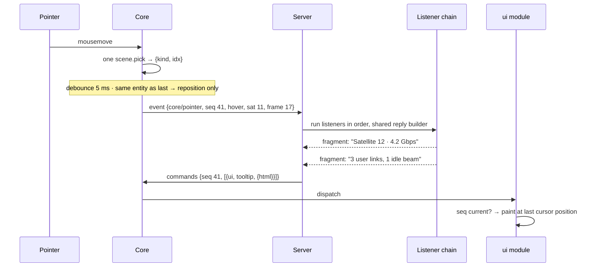
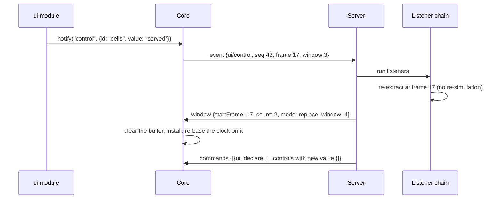
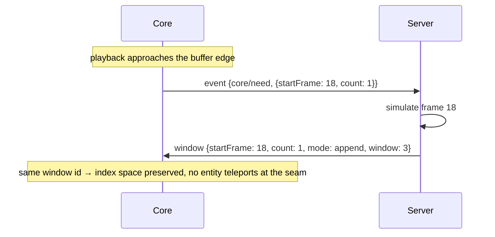

# CesiumLink wire protocol — version 1

Normative contract between the viewer (`lib/`) and a driving server (the Julia package here, or an
implementation of your own). A server must obey this document byte-for-byte.

[`module-api.md`](module-api.md) states what the ES modules this protocol declares must implement,
and what the Core hands them.

## Framing

One WebSocket at `/ws`, same-origin with the page (browser host: `?ws=<url>`, or `?ws` / `?ws=auto`
for same-origin `/ws`). Either side may send. Every frame is **binary**, and carries one message:

```
[u32 headerLen]   little-endian, at byte 0
[header]          headerLen bytes of UTF-8 JSON: the whole message
[pad]             zero bytes, up to the next multiple of 8
[region]          the array bytes the header points into
```

The region starts at `(4 + headerLen + 7) & ~7`. All integers are little-endian. A message with no
arrays has an empty region.

The header is JSON-RPC-2.0-shaped, without the `jsonrpc` field. A message with an `id` is a request
expecting `{id, result}`; without one it is a notification.

**The protocol uses no requests.** Every message is a notification, because every answer may arrive
later, more than once, or not at all.

The framing is symmetric, and **only the upward half of the array _encoder_ is missing**. A viewer
sends an empty region and refuses a typed array in an event payload, naming `Array.from()`. The
server decodes an inbound event's payload against the region it arrived with.

Three methods travel down (server → viewer), two travel up.

| Direction | Method | Purpose |
|---|---|---|
| ↓ | `modules` | The session: which ES modules to load, the shape of the globe, and the furniture |
| ↓ | `window` | A run of keyframes, with every module's payload |
| ↓ | `commands` | A batch of module-addressed commands |
| ↑ | `ready` | Handshake; triggers retained-state replay |
| ↑ | `event` | Anything the viewer reports: pointer, buffer need, control input |

Unknown methods are ignored.

### Version policy

The viewer *announces* on `ready`; the server *decides*. **On a version it does not support the
server closes the socket with a reason.** The number bumps only on breaking changes.

A viewer built against a different framing drops the frame it cannot read and reports nothing, so
the handshake is the only place to name a disagreement.

## Encoded arrays

Any numeric array, anywhere in any payload, is encoded as a self-describing object, and its bytes
sit in the frame's region:

```json
{ "$wire": "f32", "shape": [3, 264], "off": 4096 }
```

- `$wire` ∈ `f32 | f64 | u8 | u32 | i32`.
- `shape` is row-major, the last dimension varying fastest, and is **mandatory**. A flat array
  states `shape: [N]`. The server refuses a `$wire` object without it; the viewer does not recognise
  one as an encoded array and leaves it in the payload as an ordinary value. Always emit it. Only
  the labels turn around between the two sides, so a Julia `3 × 264` position array states
  `shape: [264, 3]`, and the example above is a `264 × 3` array on the Julia side.
- **`off` counts bytes from the start of the region**, never from the start of the frame.
- **`off` is always a multiple of 8**, whatever the dtype, so every array can be a `Float64Array`
  view.
- **The length is not carried.** It is `prod(shape) × bytesPerElement($wire)`. A reader must check
  `off + length ≤ region.byteLength` and refuse the frame when it does not hold.

The Core walks every inbound payload and replaces each such object with

```js
{ data: Float32Array, shape: [3, 264] }
```

before it hands the payload to the module. **This is the whole of the Core's payload knowledge.**
The browser interprets nothing else about a payload's structure.

Each array is a **view into the region**, not a copy: `data.buffer` is the whole received frame.
[`module-api.md`](module-api.md) states what a module keeps alive when it holds one past its window.

### What a Julia server converts before sending

Five dtypes travel. A server holding another numeric type converts it to the dtype that carries it
without loss. CesiumLink does this on the way out:

| Julia eltype | travels as | |
|---|---|---|
| `Float32`, `Float64` | `f32`, `f64` | |
| `UInt8`, `UInt32`, `Int32` | `u8`, `u32`, `i32` | |
| `Bool` | `u8` | JS has no boolean typed array; a module reads a flag as `data[i] !== 0` |
| `Int8`, `Int16`, `Int64` | `i32` | error unless every value fits `Int32` |
| `UInt16`, `UInt64` | `u32` | error unless every value fits `UInt32` |
| `Float16` | `f32` | always exact |
| any other `<: Number` | error | `Complex`, `Rational`, `Int128` and the like |
| anything not `<: Number` | JSON list | strings, nested payload objects, `Array{Any}` |

A value the target dtype cannot hold is an error, never a wrap-around. There is no 64-bit integer
dtype: an `Int64` past `Int32` is carried as `Float64`, exact for `|v| ≤ 2^53`.

## ↓ `modules`

The session declaration. Sent once per connection, before anything else, and retained for replay
(ADR-0009).

```json
{ "method": "modules",
  "params": {
    "modules": [
      { "id": "ui",      "url": "/modules/ui/ui.js",           "apiVersion": 1 },
      { "id": "heatmap", "url": "/modules/heatmap/heatmap.js", "apiVersion": 1 }
    ],
    "ellipsoid": { "a": 6378137.0, "b": 6356752.3142451793 },
    "furniture": {
      "items": { "timeline": false, "animation": false, "keyframe": false },
      "region": "top-right"
    },
    "assets": { "models": "assets/models/", "imagery": "assets/imagery/" },
    "imagery": { "url": "assets/imagery/{z}/{x}/{y}.png", "layout": "xyz",
                 "tiling": "mercator", "maxLevel": 5 },
    "lighting": true,
    "stars": true
  }}
```

- **`modules` order is draw order.** The viewer builds the modules in the order sent, which decides
  what draws over what and how overlay contributions stack. This is not a dependency order:
  `ctx.modules.get` reaches every module of the same declaration whatever the order.
- `ellipsoid` is the shape the scene's coordinates are on: semi-major axis `a`, semi-minor axis `b`,
  in metres. The viewer builds its globe on it and runs every conversion against it. **Optional;
  absent means WGS84.**
- `furniture` is the set of the Core's own on-screen items, in the shape the `core/furniture`
  command carries. The viewer builds that set before it paints. **Optional; absent means the viewer
  builds its default set**, which is what a recording made before this field gets. The server states
  the same set again as a retained command on `ready`, and the viewer applies that as a no-op.
- `assets` maps each assets mount name to the same-origin base the server answers it on. A payload
  points at a file by that path, `assets/models/sat.glb`, and a module resolves it through
  `ctx.assetUrl`. **Optional; absent means the server serves no directory of its own.** A browser
  host needs the map for nothing; a host on another origin builds its own URL per mount out of it.
- `imagery` is what the globe is textured with: one source as `url`, `layout` (`"xyz"` or `"tms"`),
  `tiling`, and optionally `maxLevel` and `credit`. It has **three** states. Absent means the viewer
  keeps its bundled Earth texture. `false` means no base layer at all. An object means that tile
  source. A directory of tiles this server serves is the reserved `imagery` mount, so its `url` is a
  path into the `assets` map above (ADR-0021).
- `lighting` is a boolean. It lights the globe from the sun at the clock's time, so a terminator
  runs across it. **Optional; absent leaves the globe evenly lit.**
- `stars` is a boolean. It draws the sky around the globe: the star field, the sun and the moon.
  **Optional; absent leaves black behind the globe.**
- `apiVersion` is checked against the viewer's own **before** the import, so a mismatched module
  never executes. A mismatch is warned about and skipped; the rest of the list still loads.
- `url` is same-origin and always `/modules/<id>/<basename of the registered file>`. The server
  mounts that file's whole directory, so sibling chunks and assets resolve normally. The shape is
  part of the contract: a bundle may alias an `external` dependency to that URL, and the browser keys
  module instances by resolved URL, so both modules share one live instance. That route never reaches
  the `apiVersion` gate. A module reads another declared module's exports through `ctx.modules`.
- The module set is established per connection: a second declaration is refused, and changing the
  set means the client must reconnect.
- **A browser host connecting to a server does not build its widget until this message arrives**, so
  the globe is never built on a shape the server did not name. A server that sends nothing within the
  host's timeout gets a WGS84 globe and a console line. A viewer opened with no `?ws` builds
  immediately, on WGS84.

The [module API](module-api.md) states what a declared module must export and everything it is
handed.

## ↓ `window`

The only carrier of time-varying scene data.

```json
{ "method": "window",
  "params": {
    "startFrame": 16,
    "count": 2,
    "mode": "append",
    "window": 3,
    "totalFrames": 240,
    "dtSeconds": 60,
    "intervalSeconds": 1.5,
    "startTime": "2026-07-26T10:00:00Z",
    "payloads": {
      "heatmap": { "field": {} },
      "primitives": { "nodes": [] }
    }
  }}
```

| Field | Meaning |
|---|---|
| `startFrame` | 0-based absolute index of the window's first keyframe |
| `count` | Keyframes in this window; must equal every payload's frame count |
| `mode` | `replace` clears the buffer and may re-index; `append` extends it and **must** preserve the index space |
| `window` | Identity, minted on `replace`, repeated on `append` |
| `totalFrames` | The declared range — what the clock and ruler span, however little is delivered |
| `dtSeconds` | Mission-time seconds between keyframes |
| `intervalSeconds` | Wall-clock seconds each keyframe interval plays over; larger is slower, independent of `dtSeconds`. Optional, default 1.5 |
| `startTime` | ISO-8601 UTC epoch of **absolute frame 0**, not of this window's first frame. Optional; absent → the viewer uses a synthetic epoch and the ruler shows real spacing but not real dates |
| `payloads` | `moduleId → opaque payload`, dispatched to each module's `onWindow` |

A window is the unit within which entity identity holds, and interpolation never spans two windows.
A control re-push uses `replace` (ADR-0008).

**Every module's data for the same frames arrives in one message**, so the scene and an overlay
drawn on it cannot disagree. This window does not update a module absent from `payloads`.

A static scene is a window with `count: 1`, `totalFrames: 1`.

This message does not say which time controls are on screen. The server states that with
`core/furniture`, and a scene whose one keyframe names no instant declares the band off.

The clock, the timeline ruler and scrubbing work on the declared range even when only part of it is
delivered; interpolation works on what is delivered. An instant the viewer holds no frame for stops
the clock there, so the last delivered frame stays on screen. The viewer asks for the covering
window (`core/need`) and resumes when it installs. A drag of the ruler is itself a pause: the clock
stays stopped when the window arrives. Only a clock that ran off the end of the buffer on its own
resumes by itself.

An `append` extends the buffer only if it *continues* it, at **either** end: its `startFrame` is one
past the last frame delivered, or its last frame is one before the first, which is how a clock that
runs backwards is served. An `append` that leaves a gap or overlaps is treated as a `replace`: the
viewer clears the buffer and re-bases it. A server may therefore answer any `core/need` with an
`append`: the mode states only the intent, and the viewer never claims coverage of frames it does
not hold.

The delivered buffer is **bounded** and travels with the clock: an extension that would push it past
the bound drops frames from the end playback moves away from. Only an extension is bounded, so a
server that delivers a whole run in one window gives up none of it. The viewer re-requests a dropped
frame if the clock returns to it.

## ↓ `commands`

Everything else. A batch of addressed commands, applied in order (ADR-0010).

```json
{ "method": "commands",
  "params": {
    "seq": 41,
    "commands": [
      { "module": "ui", "topic": "tooltip", "payload": { "html": ["<b>Sat 12</b>"] } },
      { "module": "heatmap", "topic": "emphasize", "payload": { "kind": "sat", "idx": 11 } }
    ]
  }}
```

- `seq` is present only when the batch answers an `event`, and echoes that event's `seq`. A module
  that cares about staleness compares it against the last event it saw. The Core never drops a stale
  batch.
- The pseudo-module id `"core"` addresses the Core itself. Its topics are `subscribe`, `furniture`,
  `regions`, `camera` and `dropped`.
- `ui/tooltip` takes two fields. `bare` is a boolean: it drops the `ui` module's own chrome, so one
  contributor owns the whole box. An empty `html`, or `"html": null`, hides the box.
- `ui/tooltip`'s `html` is a **list of fragments**, one per contributing listener, in chain order.
  The `ui` module mounts each in its own shadow root, so one contributor's CSS cannot reach
  another's. **Trust:** the `ui` module injects the fragments with `innerHTML` and never sanitizes
  them, so a server drives the page's DOM. `<script>` does not run that way; everything else does.
  This is a trusted local viewer. Revisit this before you point it at a remote or shared server.
- Unknown module or topic → warn, skip that command, continue the batch.
- A throwing handler kills its own command only.

### Retention

The server retains **the last command per `(module, topic)`**, in recency order, and replays them on
`ready`. A declaration-shaped topic (`ui/declare`, `core/subscribe`, `core/furniture`,
`core/regions`) is therefore restored on reconnect. An event-shaped one (`ui/tooltip`) is harmless to
replay, because the next pointer move overwrites it.

Retention holds **one** message per `(module, topic)`, so every declaration states its whole set and
never a patch: a stream of partial patches replays only its last frame to a reconnecting client.

A command whose payload must *not* survive a reconnect is the caller's problem.

### `core/subscribe`

```json
{ "module": "core", "topic": "subscribe",
  "payload": [
    { "type": "hover", "debounceMs": 5 },
    { "type": "click", "mods": ["alt"] },
    { "type": "click", "mods": [], "coordinate": true }
  ]}
```

A server may spell "no constraint" as an absent field or as an explicit `null`; CesiumLink sends
`null`. Read both.

The Core forwards a pointer event if it matches **any** entry:

| Field | Semantics |
|---|---|
| `type` | `hover` (pointer move) or `click` (left button down-up). Absent, or `null` → either type |
| `mods` | Exact match on the modifier set held. Absent, or `null` → any modifier state. `[]` → only when none are held. A click's set is the one held when the button went **down**, a hover's is the one held now |
| `coordinate` | If any matching entry sets it, the globe raycast is done and included |
| `debounceMs` | `hover` only; the smallest value among matching entries wins. Default 5 |

An empty list forwards nothing. The server derives this list from its registered listeners and
re-sends it whenever the set changes.

`coordinate` keeps the raycast opt-in (ADR-0003).

### `core/furniture`

**Furniture** is an item the Core puts on screen itself, before any module loads (ADR-0015). This
command states the whole set.

```json
{ "module": "core", "topic": "furniture",
  "payload": {
    "items": { "timeline": true, "animation": true, "keyframe": true, "cameraFollow": true,
               "sceneMode": true, "fullscreen": true, "home": true,
               "projection": false, "navHelp": false, "inspector": false },
    "region": "top-right",
    "style": { "gap": "4px" } }}
```

| Item | Default | What it is |
|---|---|---|
| `timeline` | on | The scrubbable date ruler along the bottom edge |
| `animation` | on | The clock face, shuttle ring and play/pause, at the bottom-left corner |
| `keyframe` | on | The readout naming the keyframe the scene's values come from. Click it to move the clock onto that keyframe |
| `cameraFollow` | on | The indicator saying who holds the camera, the way back to the declared track, and the list of the track's stops. It shows nothing until a viewpoint arrives |
| `sceneMode` | on | The 2D / 3D / Columbus picker |
| `fullscreen` | on | The fullscreen toggle |
| `home` | on | Fly the camera back to the default view |
| `projection` | **off** | The perspective / orthographic picker |
| `navHelp` | **off** | The navigation instructions |
| `inspector` | **off** | The Cesium inspector panel |

A viewer shows these defaults before any declaration arrives, and an item the declaration does not
name falls back to them. The viewer owns them; a server's keyword arguments mirror this table.

The same payload rides the session declaration (§ ↓ `modules`), which builds the first set. This
command states the set at any time after that.

`items` carries the whole set. The first four are the **band**, fixed to the bottom edge. The other
six are one **group**, a column of buttons that travels whole into the region `region` names — one of
the four overlay regions, default `top-right`. An unknown name warns and falls back to `top-right`.
`style` is CSS merged over the group's own rule, in the spelling the browser reads
(`flex-direction`, not `flex_direction`).

The viewer destroys an item turned off rather than hides it, and builds one turned on when the
declaration asks for it.

The viewer **obeys** a declaration that takes the ruler down, and warns where that strands frames:

```
furniture: timeline hidden on a 120-keyframe range; frames 2..120 are unreachable
```

The warning states each entry into that state once. A range and a furniture declaration arrive
independently, so either order produces it.

### `core/regions`

The overlay regions the Core owns, styled by declaration. Whole set as well: a region absent from
the payload returns to its Core default.

```json
{ "module": "core", "topic": "regions",
  "payload": { "top-right": { "flex-direction": "row-reverse", "gap": "12px" },
               "top-left":  { "max-width": "40%" } }}
```

The regions are `top-left`, `top-center`, `top-right` and `bottom-right`. An unknown name warns and
is ignored.

The Core owns placement (ADR-0004), so it refuses eight properties: `position`, `top`, `right`,
`bottom`, `left`, `transform`, `z-index` and `inset`. A refusal warns, names the property, and drops
that property only; the rest of the bag still applies.

```
overlay: region top-right may not set 'top' — the Core owns placement (ADR-0004)
```

### `core/camera`

The **camera track**: the ordered set of viewpoints the server declares, each saying where to look
and when it applies (ADR-0018). Whole set as well: one command carries the track, and a
re-declaration replaces it. An empty `track` clears it.

```json
{ "module": "core", "topic": "camera",
  "payload": {
    "track": [
      { "destination": { "lon": 12.5, "lat": 41.9, "height": 8000000 } },
      { "destination": { "lon": 12.5, "lat": 41.9, "height": 500000 },
        "orientation": { "heading": 0, "pitch": -60 },
        "duration": 6, "at": 59 },
      { "destination": { "west": -10, "south": 35, "east": 30, "north": 60 },
        "after": 12, "take": true }
    ] }}
```

| Field | Meaning |
|---|---|
| `destination` | A point on the globe, `{lon, lat, height}`, or a rectangle to frame, `{west, south, east, north}`. Degrees, and `height` is metres above the ellipsoid, default 0. An entry states this or `follow` |
| `follow` | What to ride, in place of standing at a destination: `{module, target}`. See **Riding an anchor** below |
| `range` | Metres from the anchor. Only an entry that rides one reads it |
| `orientation` | `heading`, `pitch` and `roll` in degrees. Each angle is optional, and one left out keeps the angle Cesium chooses. An entry that rides an anchor reads `heading` and `pitch` in the anchor's own east-north-up frame |
| `duration` | Flight time in seconds. `0` is a hard cut. Absent leaves Cesium's distance-based default |
| `at` | Absolute keyframe index, **0-based** like every index on this wire. Excludes `after` |
| `after` | Seconds after the track arrives. Absolute per entry, not cumulative. Excludes `at` |
| `take` | Take the camera back from the user before this entry applies |
| `label` | What the **stop list** calls this stop. A non-string `label` is dropped with a warning and the entry stands |

`at`, `after` and neither are the **three schedules**:

- `at` runs on the scene clock. The viewer applies the entry when the clock crosses that keyframe, so
  a pause holds the camera and a scrub back returns it to that keyframe's viewpoint.
- `after` runs on the wall clock, from the moment the track arrives. It is for a scene of one
  keyframe, which has no keyframe axis.
- Neither applies on arrival, which seeds the opening view.

The two are **mutually exclusive per entry**. Both is an authoring error: the Core warns and takes
`at`. A non-integer `at` is dropped with a warning, and so is an entry that states neither a usable
destination nor a follow anchor. An `at` past the declared range warns and never applies.

The Core applies the **latest** entry whose moment passed and that is not applied already. The order
of the list schedules nothing; each entry's own field does.

**A re-grid drops the track**, with a warning. Keyframe 120 means `epoch + 120 × dtSeconds`, so only
a change of `startTime` or of `dtSeconds` moves it. A `replace` does not, and neither does a grown
`totalFrames`. A server that re-grids must re-declare the track, and must declare it **after** the
window that establishes the new grid.

The viewer shows the track as the **stop list**, one row per entry in declared order, with the row
that applies now marked. A row reads its `label`, or falls back to its schedule — `at keyframe 19`,
`after 8 s`, `on arrival`. A click on a row puts the tour at that stop and gives the camera to the
server, the way the indicator's way back does. It belongs to the
`cameraFollow` furniture item, so a session that declares that item off gets neither the status line
nor the list.

The camera is **user state** (ADR-0017). The viewer applies a viewpoint only while the server holds
the camera. Pointer input on the canvas, a drag or a wheel, takes the camera and cancels a flight in
progress; a key press does not. Detachment is sticky: only the camera-follow indicator's way back, a
click on a stop row, or an entry carrying `take`, gives the camera to the server again.

#### Riding an anchor

A viewpoint that states `follow` holds station on a moving thing instead of standing at a point.

```json
{ "module": "core", "topic": "camera",
  "payload": { "follow": { "module": "primitives", "target": "sat[7]",
                           "range": 400000, "orientation": { "pitch": -90 }, "duration": 2 } }}
```

`follow` is the **second statement** on this topic. It sets the frame and leaves a declared track
alone, and `"follow": null` clears the frame the same way. A payload may carry `track` and `follow`
together, and each does its own half. An entry inside a `track` carries the same `follow`, `range`
and `orientation`, which is how a **tour** rides something.

| Field | Meaning |
|---|---|
| `module` | The id of a loaded module, addressed the way a command addresses one |
| `target` | What that module calls the thing to ride. **Opaque**: the viewer core never reads it, and hands it to that module to resolve (ADR-0006) |

The core resolves the anchor when the entry **applies**, never when the track arrives: the entity a
track names may not exist yet, and a `replace` window can renumber the family under it.

Three failures cost the entry and nothing else. Each warns once, and none throws:

- No module of that id is loaded.
- That module knows no such target.
- The target answered before and stops answering, because the family shrank under it. The camera
  then lets go.

**Follow is a reference frame, not a third authority state.** It says what the camera moves relative
to; `serverHolds` says whether an arriving viewpoint applies. The two are independent:

- A **drag detaches and does not dismount**. Canvas input takes the hold, so a tour stops advancing,
  and the frame stays.
- **A flight lets go first.** A flight to a destination, a rejoin, a click on a stop and the home
  button all clear the frame before they start.

`duration` flies into the ride; `0` or absent cuts straight in. An entry that states no `range` and
no angle mounts the camera exactly where it stands.

**Nothing travels upward.** There is no camera event: the viewer never reports where the user
looked, and a recording carries the camera only as the commands the server broadcast. A track is an
ordinary retained command, so a replay flies the tour with no listener behind it.

### `core/dropped`

```json
{ "module": "core", "topic": "dropped", "payload": { "n": 12 } }
```

The server queued `n` frames for this client that its queue could not hold, and dropped them. The
server holds one send queue per client, drained by one task, so a client that stops reading fills its
own queue and blocks nothing else (ADR-0030). The marker rides in front of the first frame that fits
again, so it always arrives, and it goes to one client rather than to all.

**Answer it with a `core/replay` event.** The frames are gone and the server does not re-send them on
its own. A viewer that ignores this keeps drawing the scene it last received, with nothing to say it
is stale.

This command is never retained and never recorded: it describes one connection at one moment.

## ↑ `ready`

```json
{ "method": "ready", "params": { "protocol": 1 } }
```

The viewer sends this once the socket opens. A version mismatch closes the socket with a reason
(§ Version policy). The server answers by replaying retained state in order: `modules`, then each
retained command, then the current window. The furniture therefore arrives twice, in the declaration
and again as the retained `core/furniture` command, and the viewer applies the second statement as a
no-op.

**The current window is replayed only if it is a `replace`.** An `append` extends a window this
client never received, and may omit anything that window established — an area family's footprint
centres above all. So when the scene is on an append, the server asks it for a replacement covering
the same frames and broadcasts that. The clients already watching are re-based on it and ask for what
they then miss.

With no window handler and no `core/need` listener there is nothing to ask, and the server replays
the retained window as it stands. A producer that throws or pushes nothing costs a warning rather
than the session, and the client gets the retained append rather than nothing.

## ↑ `event`

The only thing the viewer ever sends after `ready`.

```json
{ "method": "event",
  "params": {
    "module": "core",
    "topic": "pointer",
    "seq": 41,
    "frame": 17,
    "window": 3,
    "payload": {
      "type": "hover",
      "entities": [{ "module": "primitives", "kind": "sat", "idx": 11 }],
      "mods": ["alt"],
      "screen": { "x": 812, "y": 344 },
      "coordinate": { "lon": 12.49, "lat": 41.90, "height": 0 }
    }
  }}
```

| Field | Meaning |
|---|---|
| `module`/`topic` | The listener key. The `core/*` topics below are Core-produced; anything else is a module calling `ctx.notify` |
| `seq` | Monotonic per connection. Echoed by the answering batch |
| `frame` | Absolute keyframe index the clock is on — the last one at or before the current instant |
| `window` | Identity of the window on screen |
| `payload` | The topic's own content, and the only part of an event the Core does not author |
| `entities` | Every owned entity under the cursor, nearest first; `[]` on a miss. `module` is the owner that stamped the pick id |
| `mods` | For a `click`, the modifiers held when the button went **down**, so a release of alt just before the button does not turn an alt-click into a bare one. For a `hover`, the ones held now |

`seq`, `frame` and `window` sit beside `module` and `topic`, never inside `payload`. The Core stamps
them on every event, a module's own `notify` included.

Core-produced topics:

- **`core/pointer`** — as above, subject to the subscription. The viewer reports the whole stack
  under the cursor. A listener scans `entities` for the kind it wants, and the nearest one is the
  first of the list. A keyframe crossing
  under a resting cursor also raises a `hover`, at the position the cursor last moved to, re-picked,
  so a tooltip follows the clock. Such a hover carries the modifier set last seen from a real mouse
  event. The viewer drops a clock-driven hover that resolves nothing where the last one also resolved
  nothing, and sends every hover from a real move, empty or not.
- **`core/need`** — `{ "startFrame": 18, "count": 1 }`. The buffer must cover `count` frames from
  this index. `count` is 1 where the window continues the buffer at either end, and 2 where it lands
  somewhere new. The request also names the `mode` wanted, `append` unless stated otherwise. Only the
  server asks for a `replace`, on the `ready` path above; a viewer never sends `mode`.
- **`core/clock`** — `{ "multiplier": -2.0, "playing": true }`. Where the animation is going and how
  fast, sent whenever either changes and once at the start. The sign of `multiplier` is the
  direction and its magnitude is the speed, in mission seconds per real second; a declared range
  sets it to one keyframe step per real-time interval, and the shuttle ring then moves it.
  `playing` is the play/pause button and nothing else. The Core's own hold — the clock stopped while
  the buffer tops up — is not a pause and is not reported, so buffering does not read upward as the
  user pressing pause and play again. A drag of the shuttle ring writes a new multiplier per
  rendered frame and therefore sends one event per frame while it lasts.

- **`core/keyframe`** — `{ "index": 17 }`. The clock crossed into this **0-based** absolute
  keyframe, forwards or backwards. Sent on every crossing the modules are drawn for, and on the
  window that lands under a held clock. It is not sent while the buffer fails to cover the clock:
  that instant raises `core/need` instead, which is the ask a server can answer. The index is in the
  payload rather than read off the event's `frame` stamp, because the opening window crosses into
  its first keyframe before the clock has ticked once and `frame` is null until it has.

  A `core/clock` for the state the crossing happened under always precedes it, so a server never
  builds ahead in the direction of the run that just ended. A window declaring a new range writes
  the multiplier itself and crosses at once, before the next tick.

  Together with `core/clock` this is what a server builds frames ahead of `core/need` from: the
  crossing says where the clock is, and the multiplier says which way it goes and how fast. See
  [Deliver a long mission a piece at a time](../../how-to/lazy-delivery.md).

- **`core/ellipsoid`** — `{ "a": 6378137.0, "b": 6356752.3142451793 }`. The radii the globe is built
  on, sent once, as soon as it exists. It expects no reply; it confirms the numbers the server
  declared. A server that receives different ones must say so loudly: a scene drawn on the wrong
  shape looks plausible and is wrong by kilometres.

- **`core/replay`** — `{}`. Send this client the retained scene again: every retained
  `(module, topic)` in recency order, and the window. A client sends it after a `core/dropped`
  command, and the server answers it itself; no listener sees the pair. The reply is the same set a
  client connecting now is replayed. Ask for it as often as needed: a replay changes no server
  state.

- **`core/stop`** — `{}`. Stop this server. The server removes its discovery file, then drops every
  client socket and frees the port, exactly as `stop_server` does. No listener sees this pair, so a
  scene cannot refuse a stop. A second `core/stop` does nothing. Any client on the socket may send
  it: the socket binds to loopback. Send no `ready` first: it makes the server replay the whole
  retained scene to a client that is about to close.

Module-produced topics come from `ctx.notify(topic, payload)`. The Core stamps `module`, `seq`,
`frame` and `window` and forwards the event, subject to no subscription. The server itself answers
one of them, rather than a scene:

- **`ui/rect`** — `{ "id": "panel", "x": 120, "y": 60, "w": 360, "h": 240 }`. Where the user left a
  float, in whole container pixels, sent once when the pointer comes up. The `ui` module sends it
  only for a float declared `adjustable: true`, which is what draws the drag strip and the resize
  corner. `x`/`y` are the box's top-left.

  A rect belongs to the user, so the server records it per float id and states it in every later
  declaration of that float: the anchor becomes `{"anchor": "screen", "x": …, "y": …}` and the size
  joins the float's own `style` as CSS `width` and `height`. Nothing new travels downward. The server
  re-sends the declared set as soon as it records a rect, so the retained copy carries where the
  boxes were left.

  **A declared rect seeds a box when the box is created and moves no box already on screen.** This is
  the one place a declaration does not overrule what the viewer shows (ADR-0013).

- **`ui/close`** — `{ "id": "panel" }`. The user pressed a float's close button, which the `ui`
  module draws only for a float declared `closable: true`. The server answers nothing on its own: a
  listener decides whether to re-declare the float without it, and a scene with no listener leaves
  the box where it is.

## Index bases

Non-negotiable: **the wire is 0-based, the Julia API is 1-based.** The conversion happens in exactly
one place per direction, at the CesiumLink boundary. Entity numbers shown to a user are 1-based.

## Flows

### Hover → tooltip



### Control input → re-push



Playback runs on through the round trip: the scene stays on screen until the replacement window
installs, and a `replace` re-bases the clock on what it delivers.

A widget reports the user's input and goes on showing the value it was declared with, so an input no
listener acts on needs no answer. The re-declaration moves the widget.

### Streaming advance



## What stays a convention

Everything the viewer draws rides a window, pinning included: a pin is a pointer event answered by a
`replace` whose families are populated for it. No content arrives for frames the viewer already
holds, so there is no identity to check.

If a full re-push ever proves too coarse, the escape hatch is a `commands` batch whose payload
carries the window identity it was computed against, and the receiving module drops the batch once
that identity is no longer current — the ADR-0008 guard. Nothing uses it today, and every event
already carries `window`, so adopting it costs a module-side check rather than a wire change.
